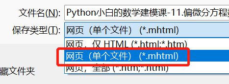

# 说明

一些 JupyterNotebook，用于在我的 Hexo 博客中加载显示

 `.mhtml` 文件：用于回顾的网页存档文件（防止从互联网上消失或无法访问，若有侵权请联系删除）

# Hexo 博客中 JupyterNotebook 加载实现方式

复制 GitHub 上的 JupyterNotebook 链接


打开网站 https://nbviewer.org/ 粘贴地址，再点击 Go！复制跳转后的链接


然后在 Markdown 文件中使用 iframe 标签引用该链接，如

```html
<iframe src="https://nbviewer.org/github/xuanyabulema/JupyterNotebook/blob/main/ODE.ipynb" width="100%" height="600"></iframe>
```

# mhtml网页保存方式

在 `Chrome` 浏览器中打开想保存的网页，按下快捷键 `Ctrl + S` , 选择“网页（单个文件）（*.mhtml）”进行保存



