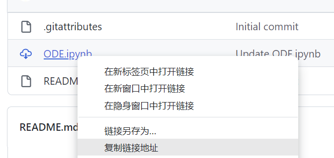
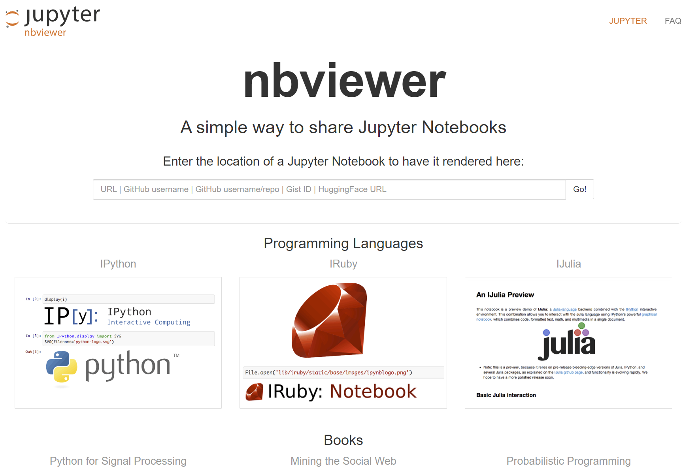

# 说明

一些 JupyterNotebook，用于在我的 Hexo 博客中加载显示

# 方式

复制 GitHub 上的 JupyterNotebook 链接



打开网站 https://nbviewer.org/ 粘贴地址，再点击 Go！复制跳转后的链接



然后在 Markdown 文件中使用 iframe 标签引用该链接，如

```html
<iframe src="https://nbviewer.org/github/xuanyabulema/JupyterNotebook/blob/main/ODE.ipynb" width="100%" height="600"></iframe>
```


